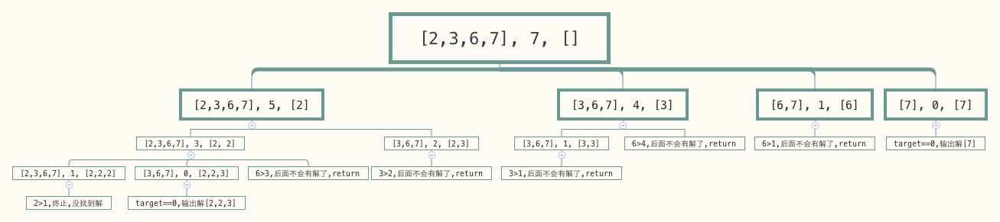

# Combination Sum

来源：<https://leetcode.com/problems/combination-sum/>

## 问题描述

Given a set of candidate numbers (**C**) and a target number (**T**), find all unique combinations in **C** where the candidate numbers sums to **T**.

The **same** repeated number may be chosen from **C** unlimited number of times.

**Note:**

- All numbers (including target) will be positive integers.
- The solution set must not contain duplicate combinations.

For example, given candidate set `[2, 3, 6, 7]` and target `7`, 
A solution set is: 

```
[
  [7],
  [2, 2, 3]
]
```

给定一个数组C和一个数字T,找出所有的组合使其和等于T（C中的数字和T都是正数，找到的任意两个组合不能重复）。

C中的数字可以无限制地重复使用。

例如：给定 `C = [2, 3, 6, 7]` 和 `T = 7`， 所有组合为：

```
[
  [7],
  [2, 2, 3]
]
```

## 代码1

```go
func CombinationSum2(candidates []int, target int) [][]int {
	sort.Ints(candidates)
	result := [][]int{}
	combinationSum2Help(nil, candidates, target, &result)
	return result
}

func combinationSum2Help(com []int, candidates []int, target int, result *[][]int) {
	if target == 0 {
		// 复制一份，不然执行 com = com[:len(com)-1] 时会覆盖com的元素
		comCopy := make([]int, len(com))
		copy(comCopy, com)
		*result = append(*result, comCopy)
		return
	}
	if target > 0 {
		// 拿取第一个放到结果里，然后递归再从当前位置开始拿，直到 target 为0说明找到了一个序列
		for i := 0; i < len(candidates); i++ {
			num := candidates[i]
			if target >= num {
				com = append(com, num)
				// 这里从 candidates[i:] 开始查找而不是 i+1， 因为 candidates 中的元素可以重复利用
				combinationSum2Help(com, candidates[i:], target-num, result)
				com = com[:len(com)-1]
				continue
			}
			return
		}
	}

	return
}
```

首先，我们先确认解的第一个元素，代码中 `for i := 0; i < len(candidates); i++` 遍历 `candidates` 中的元素并将其当做解的第一个值，那么我们再从 `candidates` 中找到相加等于 `target-num` 的组合就可以了，所以递归调用 `combinationSum2Help` 从 `candidates[i:]` 找出和等于 `target-num` 的组合。

这里从 `candidates[i:]` 开始查找而不是 `candidates[i+1:]` 是因为 `candidates` 中的元素可以重复利用，我们在递归时依然可能选中 `num` 作为解的一部分。

假如这里直接传的是 `candidates` 那么递归的时候就直接从开始位置查找了，那么我们可能会找到元素相同但顺序不同的组合，比如 `[1,2,3]` 和 `[2,1,3]` 这样的。

既然是递归，就得有终止条件，这里是 `if target == 0` ，当 `target == 0` 时意味着我们一路递归下来遇到的 `num` 们正好将 `target` 减完了，所以遇到的所有的 `num` 加起来正好等于 `target`，这正是我们要找的其中一个解。

为什么要先排序呢？在递归之前我们判断了 `target` 是否大于等于 `num`，如果 `target < num` 那么 `target` 也小于 `num` 之后的数，后面的数就不需要判断了，可以直接 `return` 了，如果没有排序的话，当 `target < num` 时还得继续判断 `num` 后面的数。

下面的图展示了调用 `CombinationSum2([2,3,6,7], 7)` 的过程：



每个节点包含三部分，分别是 `candidates` ，`target`, `com`。

每一层对应的是 `for i := 0; i < len(candidates); i++` 每次循环的情况，以第1层为例，`[2,3,6,7], 5, [2]` 表示遍历第一个元素，即 `num==2` 的情况，此时要递归调用`combinationSum2Help` 的参数： `candidates=[2,3,6,7]`, `target=5`, `com=[2]`。 第一层第二个节点中表示正在遍历第二个元素，即 `num=3` 的情况，此时要递归传递的参数分别是：`candidates=[3,6,7]`, `target=4`, `com=[3]`。

