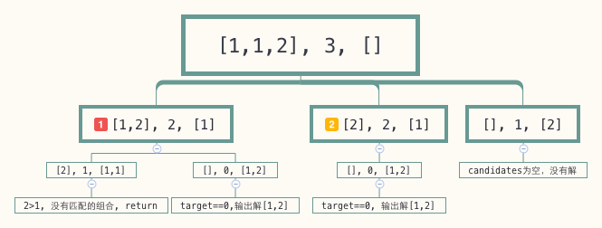

# Combination Sum 2

来源：<https://leetcode.com/problems/combination-sum-ii/>

# 问题

Given a collection of candidate numbers (**C**) and a target number (**T**), find all unique combinations in **C** where the candidate numbers sums to **T**.

Each number in **C** may only be used **once** in the combination.

**Note:**

- All numbers (including target) will be positive integers.
- The solution set must not contain duplicate combinations.

For example, given candidate set `[10, 1, 2, 7, 6, 1, 5]` and target `8`, 
A solution set is: 

```
[
  [1, 7],
  [1, 2, 5],
  [2, 6],
  [1, 1, 6]
]
```

给定一个数组C和一个数字T,找出所有的组合使其和等于T（C中的数字和T都是正数，找到的任意两个组合不能重复）。

C中的数字只可以使用一次。

例如：给定 `C = [10, 1, 2, 7, 6, 1, 5]` 和 `T = 8`， 所有组合为：

```
[
  [1, 7],
  [1, 2, 5],
  [2, 6],
  [1, 1, 6]
]
```

# 代码

```go
func CombinationSum2(candidates []int, target int) [][]int {
	sort.Ints(candidates)
	result := [][]int{}
	combinationSum2Help(candidates, target, nil, &result)
	return result
}

func combinationSum2Help(candidates []int, target int, com []int, result *[][]int) {
	if target > 0 {
		for i, c := range candidates {
			// 去掉重复的
			// candidates 中可以有重复的，这会递归中选中重复的，这里去重是保证 candidates 中重复的元素不会被过多的使用
			if i > 0 && c == candidates[i-1] {
				continue
			}
			if target >= c {
				com = append(com, c)
				combinationSum2Help(candidates[i+1:], target-c, com, result)
				com = com[:len(com)-1]
				continue
			}
			return
		}
	}
	if target == 0 {
		comCopy := make([]int, len(com))
		copy(comCopy, com)
		*result = append(*result, comCopy)
		return
	}
}
```

这里的思路基本和 [Combination Sum](combination_sum.md) 中的一样，有几处不同的地方：

- 递归调用时 `candidates` 传递的是 `candidates[i+1:]`。 因为题目中说 `candidates` 中的元素只能使用一次，既然我们选定了 `candidates[i]`， 那么下次就应该从 `candidates[i+1]` 开始检测。

- 多出了一个 `if i > 0 && c == candidates[i-1]` 的判断。这种情况出现在 `candidates` 中有重复的元素，比如 `combinations=[1, 1, 2], target=3`的情况：

  

  图中(1)表示遍历第一个元素1，此时 `candidates=[1,2], target=2, com=[1]`, 可以看到递归后可以得到一个解 `[1,2]`， 图中(2)当我们遍历第二个元素1时，也会得到解 [1,2]，这样的话就出现了重复解，因此代码中将情况(2)排除。

